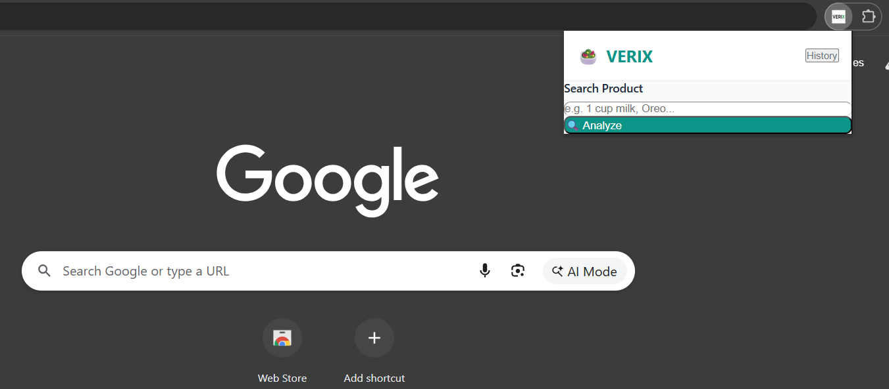
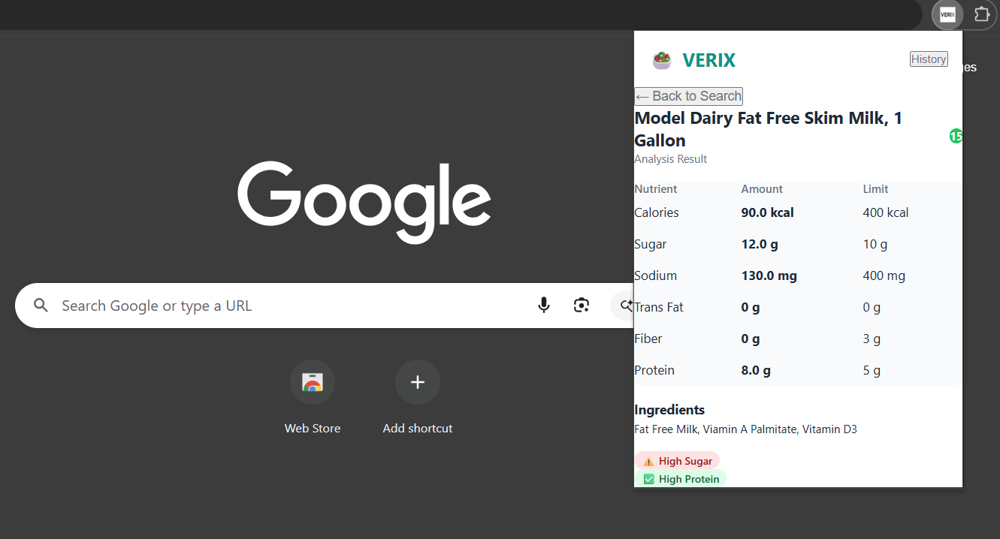
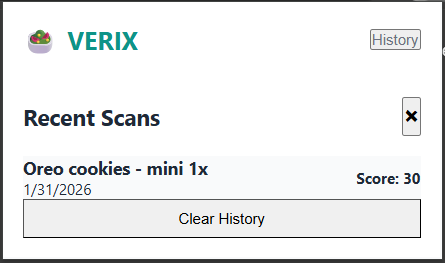

# 🥗 VERIX: Smart Nutrition Analyzer

**Make healthy choices instantly, right from your browser.**

[](https://luci-xo.github.io/VERIX/)
[](https://opensource.org/licenses/MIT)

VERIX is a privacy-first Chrome Extension designed to decode complex nutrition labels into simple, actionable insights. By leveraging the **Spoonacular API**, it analyzes food products in real-time and assigns a clear **Color-Coded Health Score** (Green/Red), helping users spot hidden sugars and high sodium levels without the guesswork.

---

## 📸 Screenshots & Features

### 1. Simple, Privacy-First Interface
*The first impression of the extension. Clean, distraction-free, and ready to search instantly without any login.*


### 2. Instant Health Analysis
*See VERIX in action: Analyzing a product sample to detect hidden risks like high sugar or sodium.*


### 3. Smart History Tracking
*Keep track of your past scans. Your history is stored locally on your device for total privacy.*


---

## 🚀 Key Features
* **Instant Analysis:** Type a product name (e.g., "Oreo") and get instant nutritional feedback.
* **Visual Health Score:** Simple **Red (High Risk)** vs. **Green (Safe)** badges based on daily recommended limits.
* **Privacy First:** All data processing happens locally in your browser. No accounts needed.
* **History Tracking:** Saves your recent scans locally so you can compare products easily.

---

## 🛠️ Tech Stack
* **Frontend:** HTML, CSS, Vanilla JavaScript
* **Platform:** Chrome Extension (Manifest V3)
* **Data Engine:** Spoonacular API (Real-time Global Nutrition Database)
* **Architecture:** Serverless / Client-Side

---

## 👥 The Team
Built with ❤️ for **Hackathon 2026** by:

| Name | Role |
| :--- | :--- |
| **Khusham Jolly** | 🏗️ System Architect Lead |
| **Lakshay Chauhan** | 📊 Research and Data Lead |
| **Amit Khatri** | 🎨 Frontend & UX Lead |
| **Ayan Bhardwaj** | 🎤 Pitch & Demo Lead |

---

## 🔑 API Key Configuration (If Quota Exceeded)
The included API key has a daily limit. If you see an error or the app stops working, follow these steps to use your own free key:

1.  **Get a Key:** Go to [Spoonacular API](https://spoonacular.com/food-api/console#profile) and sign up (it's free).
2.  **Copy Key:** Copy your new `API Key` from the dashboard.
3.  **Update Code:**
    * Open `popup.js` in your code editor.
    * Find the line: `const API_KEY = '...';` (usually at the top).
    * Replace the text inside the quotes with your new key.
    * Save the file.
4.  **Reload:** Go to `chrome://extensions` and click the **Refresh** icon on the VERIX card.

## 🏃‍♂️ How to Run Locally

Since VERIX is a client-side Chrome Extension, you do not need to install any dependencies.

1. **Clone** this repository.
   ```bash
   git clone [https://github.com/YourUsername/VERIX.git](https://github.com/YourUsername/VERIX.git)
